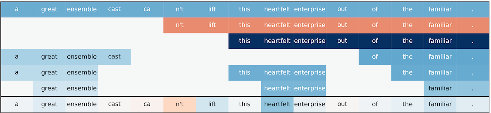
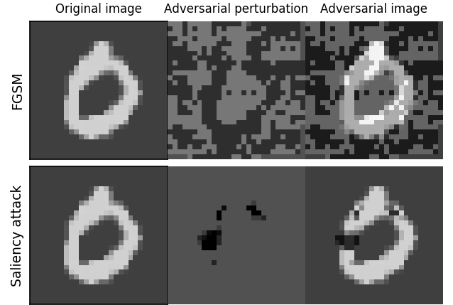
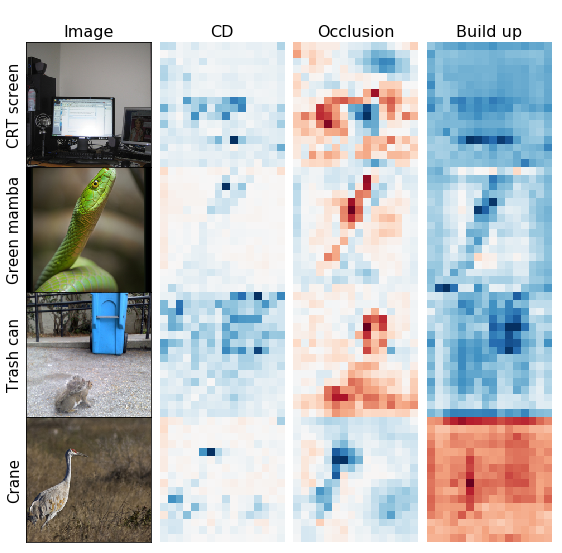

Official code for using / reproducing ACD from the paper *Hierarchical interpretations for neural network predictions* (ICLR 2019 [pdf](https://openreview.net/pdf?id=SkEqro0ctQ)). This code produces hierarchical interpretations for a single prediction made by a neural network.

*Note: this repo is actively maintained. For any questions please file an issue.*


# examples/documentation

- **installation**: `git+https://github.com/csinva/hierarchical-dnn-interpretations`
- **examples**: the [reproduce_figs](reproduce_figs) folder has notebooks with many demos
- **api**: the [api](https://csinva.github.io/hierarchical-dnn-interpretations/docs/acd/) gives a list of available functions
- **src**: the [acd](acd) folder contains the source for the method implementation
- allows for different types of interpretations by changing hyperparameters (explained in examples)
- tested with python3 and pytorch >1.0 with/without gpu 
- all required data/models/code for reproducing are included in the [dsets](dsets) folder

| Inspecting NLP sentiment models    | Detecting adversarial examples      | Analyzing imagenet models           |
| ---------------------------------- | ----------------------------------- | ----------------------------------- |
|  |  |  |


# notes on using ACD on your own data
- the current CD implementation doesn't always work for all types of networks. If you are getting an error inside of `cd.py`, you may need to write a custom function that iterates through the layers of your network (for examples see `cd.py`). Should work out-of-the-box for many common layers though, including antyhing in alexnet, vgg, or resnet.
- to use baselines such build-up and occlusion, replace the pred_ims function by a function, which gets predictions from your model given a batch of examples.


# related work

- PDR framework (PNAS 2019 [pdf](https://arxiv.org/abs/1901.04592)) - an overarching framewwork for guiding and framing interpretable machine learning
- CDEP (ICML 2020 [pdf](https://arxiv.org/abs/1909.13584), [github](https://github.com/laura-rieger/deep-explanation-penalization)) - penalizes CD / ACD scores during training to make models generalize better
- TRIM (ICLR 2020 workshop [pdf](https://arxiv.org/abs/2003.01926), [github](https://github.com/csinva/transformation-importance)) - using simple reparameterizations, allows for calculating disentangled importances to transformations of the input (e.g. assigning importances to different frequencies)
- DAC (arXiv 2019 [pdf](https://arxiv.org/abs/1905.07631), [github](https://github.com/csinva/disentangled-attribution-curves)) - finds disentangled interpretations for random forests
- Baseline interpretability methods - the file `scores/score_funcs.py` also contains simple pytorch implementations of [integrated gradients](https://arxiv.org/abs/1703.01365) and the simple interpration technique `gradient * input`

# reference

- feel free to use/share this code openly
- if you find this code useful for your research, please cite the following:

 ```r
@inproceedings{
    singh2018hierarchical,
    title={Hierarchical interpretations for neural network predictions},
    author={Chandan Singh and W. James Murdoch and Bin Yu},
    booktitle={International Conference on Learning Representations},
    year={2019},
    url={https://openreview.net/forum?id=SkEqro0ctQ},
}
```
  
